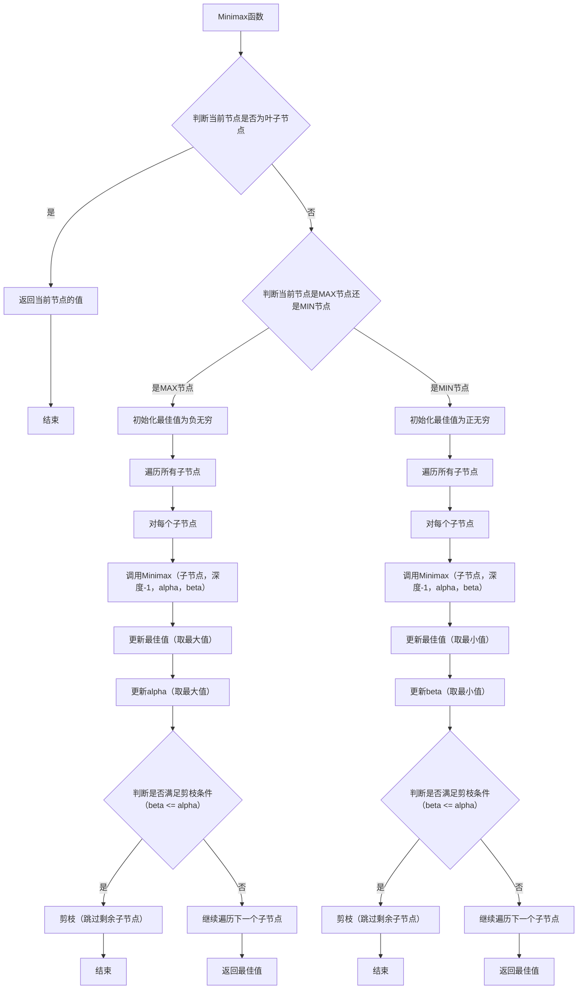

```mermaid
graph TD;
    A[Minimax函数] --> B{判断当前节点是否为叶子节点}
    B -- 是 --> C[返回当前节点的值]
    C --> D[结束]
    B -- 否 --> E{判断当前节点是MAX节点还是MIN节点}
    E -- 是MAX节点 --> F[初始化最佳值为负无穷]
    F --> G[遍历所有子节点]
    G --> H1[对每个子节点]
    H1 --> I1[调用Minimax（子节点，深度-1，alpha，beta）]
    I1 --> J1[更新最佳值（取最大值）]
    J1 --> K1[更新alpha（取最大值）]
    K1 --> L1{判断是否满足剪枝条件（beta <= alpha）}
    L1 -- 是 --> M1[剪枝（跳过剩余子节点）]
    M1 --> N1[结束]
    L1 -- 否 --> O1[继续遍历下一个子节点]
    O1 --> P1[返回最佳值]
    E -- 是MIN节点 --> Q[初始化最佳值为正无穷]
    Q --> R[遍历所有子节点]
    R --> H2[对每个子节点]
    H2 --> I2[调用Minimax（子节点，深度-1，alpha，beta）]
    I2 --> J2[更新最佳值（取最小值）]
    J2 --> K2[更新beta（取最小值）]
    K2 --> L2{判断是否满足剪枝条件（beta <= alpha）}
    L2 -- 是 --> M2[剪枝（跳过剩余子节点）]
    M2 --> N2[结束]
    L2 -- 否 --> O2[继续遍历下一个子节点]
    O2 --> P2[返回最佳值]

```