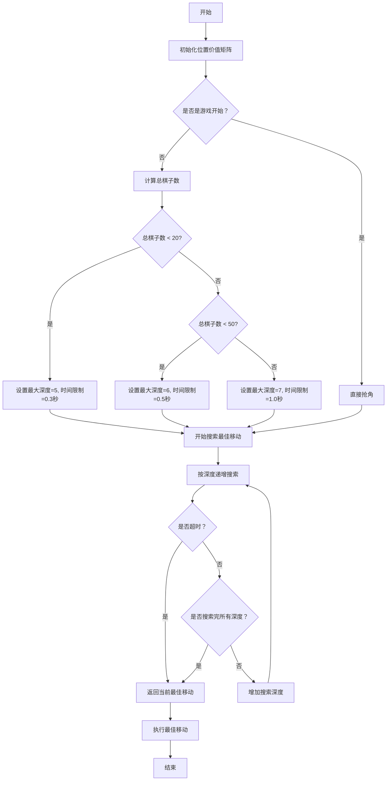

```mermaid
graph TD
    A[开始] --> H[初始化位置价值矩阵]
    H --> I{是否是游戏开始？}
    I -->|是| J[直接抢角]
    I -->|否| K[计算总棋子数]
    K --> L{总棋子数 < 20?}
    L -->|是| M[设置最大深度=5, 时间限制=0.3秒]
    L -->|否| N{总棋子数 < 50?}
    N -->|是| O[设置最大深度=6, 时间限制=0.5秒]
    N -->|否| P[设置最大深度=7, 时间限制=1.0秒]
    M --> Q[开始搜索最佳移动]
    O --> Q
    P --> Q
    J --> Q
    Q --> R[按深度递增搜索]
    R --> S{是否超时？}
    S -->|是| T[返回当前最佳移动]
    S -->|否| U{是否搜索完所有深度？}
    U -->|是| T
    U -->|否| V[增加搜索深度]
    V --> R
    T --> W[执行最佳移动]
    W --> X[结束]
```