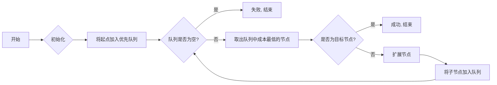

```mermaid
graph LR
    A[开始] --> B{初始化}
    B --> C[将起点加入优先队列]
    C --> D{队列是否为空?}
    D -- 是 --> G[失败, 结束]
    D -- 否 --> E[取出队列中成本最低的节点]
    E --> F{是否为目标节点?}
    F -- 是 --> H[成功, 结束]
    F -- 否 --> I[扩展节点]
    I --> J[将子节点加入队列]
    J --> D

```