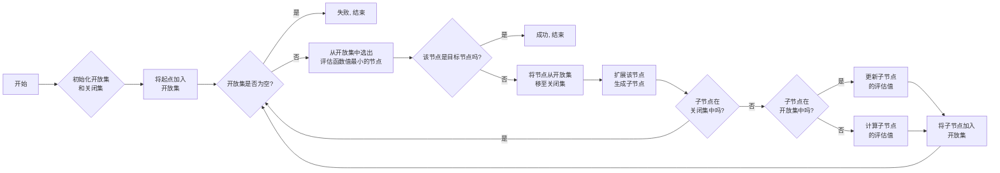

```mermaid
graph LR
    A[开始] --> B{初始化开放集<br>和关闭集}
    B --> C[将起点加入<br>开放集]
    C --> D{开放集是否为空?}
    D -- 是 --> H[失败, 结束]
    D -- 否 --> E[从开放集中选出<br>评估函数值最小的节点]
    E --> F{该节点是目标节点吗?}
    F -- 是 --> I[成功, 结束]
    F -- 否 --> G[将节点从开放集<br>移至关闭集]
    G --> J[扩展该节点<br>生成子节点]
    J --> K{子节点在<br>关闭集中吗?}
    K -- 是 --> D
    K -- 否 --> L{子节点在<br>开放集中吗?}
    L -- 是 --> M[更新子节点<br>的评估值]
    L -- 否 --> N[计算子节点<br>的评估值]
    M --> O[将子节点加入<br>开放集]
    N --> O
    O --> D

```