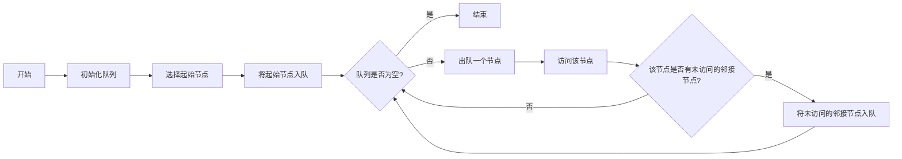

```mermaid
graph LR
    A[开始] --> B[初始化队列]
    B --> C[选择起始节点]
    C --> D[将起始节点入队]
    D --> E{队列是否为空?}
    E -->|是| F[结束]
    E -->|否| G[出队一个节点]
    G --> H[访问该节点]
    H --> I{该节点是否有未访问的邻接节点?}
    I -->|是| J[将未访问的邻接节点入队]
    J --> E
    I -->|否| E

```