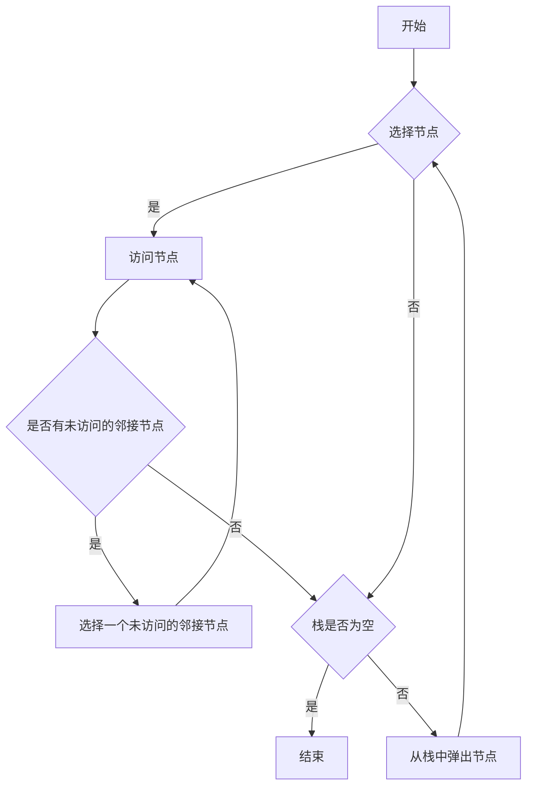

```mermaid
graph TD
    A[开始] --> B{选择节点}
    B -->|是| C[访问节点]
    C --> D{是否有未访问的邻接节点}
    D -->|是| E[选择一个未访问的邻接节点]
    E --> C
    D -->|否| F{栈是否为空}
    F -->|是| G[结束]
    F -->|否| H[从栈中弹出节点]
    H --> B
    B -->|否| F

```