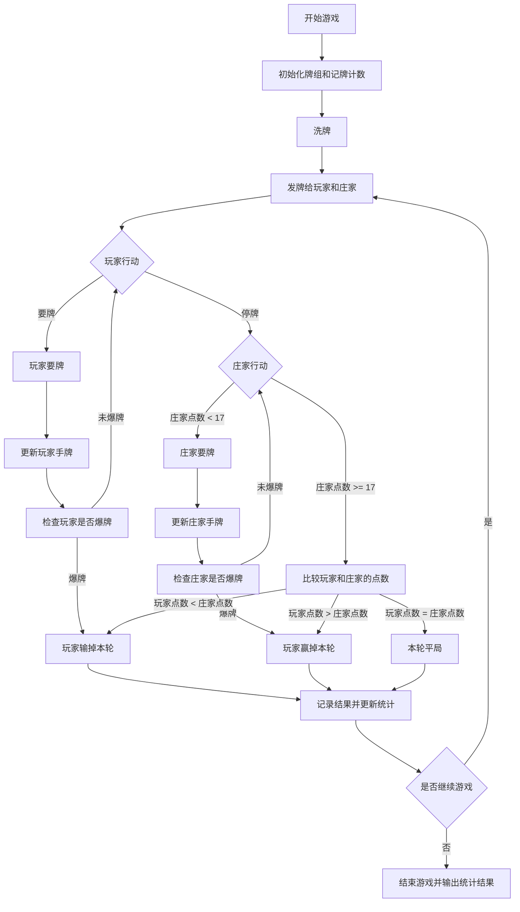

```mermaid
graph TD
    A[开始游戏] --> B[初始化牌组和记牌计数]
    B --> C[洗牌]
    C --> D[发牌给玩家和庄家]
    D --> E{玩家行动}
    E -->|要牌| F[玩家要牌]
    F --> G[更新玩家手牌]
    G --> H[检查玩家是否爆牌]
    H -->|爆牌| I[玩家输掉本轮]
    H -->|未爆牌| E
    E -->|停牌| J{庄家行动}
    J -->|庄家点数 < 17| K[庄家要牌]
    K --> L[更新庄家手牌]
    L --> M[检查庄家是否爆牌]
    M -->|爆牌| N[玩家赢掉本轮]
    M -->|未爆牌| J
    J -->|庄家点数 >= 17| O[比较玩家和庄家的点数]
    O -->|玩家点数 > 庄家点数| N
    O -->|玩家点数 < 庄家点数| I
    O -->|玩家点数 = 庄家点数| P[本轮平局]
    I --> Q[记录结果并更新统计]
    N --> Q
    P --> Q
    Q --> R{是否继续游戏}
    R -->|是| D
    R -->|否| S[结束游戏并输出统计结果]
```